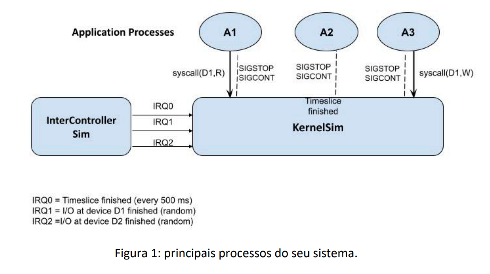

# Trab1-2025-2

## Simulando o escalonamento preemptivo de processos com chamadas de sistema  

### Primeiro Trabalho de Sistemas de Computação – INF 1316  

- **Prazo de entrega (envio por E-mail):** 19 de outubro, 23:59  
- **Data de apresentação (na bancada):** 21 de outubro, 11–13 hs  

---

## Introdução  

O primeiro trabalho consiste em programar (em linguagem **C** e usando as primitivas `fork/exec`, sinais e comunicação Inter processos do Unix/Linux) um **simulador de um kernel/núcleo de sistema operacional (KernelSim)** que gerencia de **5 processos de aplicação (A1, A2, A3, A4, A5)** e intercala as suas execuções a depender se estão esperando pelo término de uma operação de leitura ou escrita em um dispositivo de E/S simulado (sendo que há dois deles, **D1** e **D2**), ou o uma interrupção sinalizando o término de uma **"fatia de tempo"** (i.e. um time slice, ou intervalo de tempo para escalonamento RoindRobin). Para isso você deverá implementar também um processo adiciona que **emula o controlador de interrupções (InterController Sim)**. Este deve gerar as interrupções referentes ao time-slice e ao término da operação de E/S nos dispositivos D1 e D2.

- **IRQ0:** TimeSlice  
- **IRQ1:** término de operação em D1  
- **IRQ2:** término de operação em D2  

A Figura 1 mostra os principais elementos do sistema.



> No seu programa, cada um dos elementos em azul-cinza da Fig. 1 deve ser um processo Unix. Tanto **InterControllerSim** como **KernelSim** devem ser processos infinitos que executam em pararelo. 

---

## Uso de Sinais UNIX  

Para emular as interrupções (geradas por InterController Sim) e tratadas por KernelSim, você pode usar qualquer mecanismo de comunicação **IPC** (como *pipes*, *shared memory* ou *FIFO*), mas é **obrigatório o uso dos sinais**:  
- `SIGSTOP` → interrompe um processo de aplicação  
- `SIGCONT` → retoma um processo de aplicação  

para  permitir  que  o  KernelSim  interrompa  e  retome, respectivamente, a execução dos processos de aplicação A1,.., A5.

---

## Time-Sharing  

Qualquer processo **Ax** pode  executar  ininterruptamente  no  máximo  durante **TimeSlice segundos**. Portanto, quando chega um **IRQ0 (TimeSlice)**, o **KernelSim** deve:
1. Enviar um `SIGSTOP` para o processo em execução.  
2. Escolher outro processo **Ay** que não esteja bloqueado por E/S.  
3. Enviar `SIGCONT` para ativar o novo processo.  

Mais ainda, se dois processos, digamos **Ay** e **Az**, tiverem executado uma syscall para o mesmo dispositivo, digamos D2, (e a chamada de Ay aconteceu antes da chamada de Az), então o **primeiro IRQ2** representará o término da primeira chamada (e irá desbloquear Ay) e o **segundo IRQ2**  sinalizará o termino do segundo syscall (e irá desbloquear Az).

---

## Chamada de Sistema (syscall)  

Quando um processo de aplicação, digamos A1, executar um **syscall(D2, W)**:
- É imediatamente interrompido pelo KernelSim (`SIGSTOP`);  
- Inserido na fila de processos bloqueados do dispositivo **D2**;  
- Fica aguardando até que o **InterController Sim** gere um **IRQ2**, liberando o primeiro processo bloqueado para aquele dispositivo com um `SIGCONT`.  

Em vez de simularmos um tempo específico que cada um dos dispositivos D1 e D2 precisam para executar  as  operações  E/S  solicitadas  pela  syscall(),  faremos  o **InterController Sim** gerar aleatoriamente interrupções para cada dispositivo (D1/D2) que indicam o termino de qualquer pedido de IO no dispositivo correspondente. 

### Frequências de geração de IRQ:
- **IRQ0 (TimeSlice):** a cada 500 ms (use sleep() dentro do corpo do loop)
- **IRQ1:** probabilidade P₁ = 0.1 (a cada 500 ms)
- **IRQ2:** probabilidade P₂ = 0.005 (a cada 500 ms)

> Obs.: Se você achar que essas frequências estão dificultando visualizar a execução, você pode alterar a periodicidade do Timslice e as probabilidades de P_1 e P_2, mas a sempre mantendo a probabilidade de P_1 vinte vezes maior do que a de P_2. É como se o dispositivo D1 fosse, na média, 20 x mais rápido do que o D2.  

---

## Processos de Aplicação  

Cada processo de aplicação **Ax** deve consistir de um **loop de até MAX iterações** e ter um contador de interações chamado de **ProgramCounter (PC)**.  

O corpo do loop deve conter:
- `sleep(1)`  
- Uma escolha aleatória (com baixa probabilidade) de executar uma syscall:  
  `syscall(Dx, R/W/X)`  
  — onde Dx (D1 ou D2) e a operação (R, W ou X) são escolhidos aleatoriamente.  

### Exemplo:
```c
while (PC < MAX) {
    sleep(0.5);
    if (d = rand() % 100 + 1 < 15) { // gera syscall aleatória
        if (d % 2) Dx = D1;
        else Dx = D2;

        if (d % 3 == 1) Op = R;
        else if (d % 3 == 2) Op = W;
        else Op = X;

        // syscall(Dx, Op)
    }
    sleep(0.5);
}
```

---

## Troca de Contexto  

No seu sistema a **troca de contexto** acontecerá a cada vez que houver o chaveamento de um processo de aplicação para um outro. 
O contexto deve incluir pelo menos:

- O **contador PC**;  
- Os **parâmetros da syscall** (D1 ou D2, 
R/W ou X).  

Então, ao reativar um processo anteriormente interrompido o seu contexto completo anteriormente salvo deve ser restaurado, em parte para garantir que todos os processos de aplicação Ax executem exatamente **MAX interações**.

---

## Visualizando os Estados dos Processos  

O simulador, em especial o **InterController Sim**, deve poder ser interrompido e retomado (ex.: via **Ctrl+C PID_simulador**).  
Quando parado, o **InterControllerSim** deve mostrar, para cada processo **APx**:

- Valor do **PC**  
- **Estado atual** (executando, bloqueado, terminado etc.)  
- Se bloqueado: **em qual dispositivo** e **com qual operação**  
- Se executando: o KernelSim enviou `SIGCONT` e ainda não `SIGSTOP`  
- Quantas vezes acessou cada dispositivo desde o início  
- Se está **terminado**

---

## Observações Finais  

### Avaliação  
O trabalho pode ser feito **individualmente ou em dupla**.  

- **Envio:** até a data de entrega por e-mail ao professor e monitor.  
- **Apresentação:** obrigatória, na data e horário indicados, em aula de laboratório (necessariamente com a presença da 
dupla).  
- **Atraso:** cada dia de atraso reduz **1 ponto** da nota máxima.  

### Entrega  
Deve ser entregue:
- **Código-fonte completo**  
- **Relatório explicativo** descrevendo todos os programas e testes realizados  

A explicação será parte da avaliação.  

