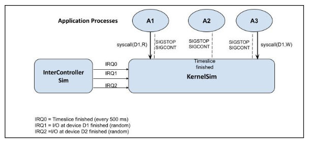
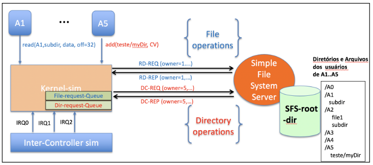
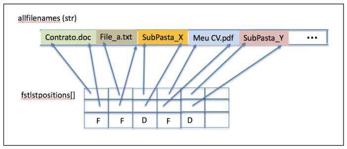

# Implementando um micro-kernel e um Sistema de Arquivos Remoto acessado via UDP

4 de Novembro 2025

Segundo Trabalho de Sistemas de Computação – INF 1316

● Prazo de entrega (envio por E-mail): 2 de dezembro, 23:59  
● Data de apresentação (na bancada): 4 de dezembro, 11-13 hs

## Introdução

No trabalho T1 você desenvolveu um simulador de um núcleo de SO (KernelSim) que gerencia processos de aplicação (A1,..,A5) solicitantes de acesso a dois dispositivos hipotéticos, D1 e D2 e que também reage a interrupções de hardware/relógio simuladas de um (InterContoler Sim). Abaixo está a figura que orientou você no T1.


Fig.1: A estrutura do T1

Nesse segundo trabalho, T2, você vai estender o T1 acrescentando o acesso a arquivos e diretórios remotos, e irá concretizar as sys_calls dos processos A1-A5 para pedidos a um servidor de Sistema de Arquivos remoto, o Simple File System Server (SFSS).

Em vez de serem chamadas sys_call para realizar rwx em dispositivos genéricos D1/D2, agora serão system calls para criar, remover, ler e modificar arquivos e diretórios remotos, ou seja, que são gerenciados em uma máquina remota. Dessa forma você vai estar implementando algo muito próximo a um micro-kernel, que envia requisições ao SFSS usando um protocolo de comunicação na rede. Portanto, para o T2, o seu antigo KernelSim deverá ser modificado para ser capaz de processar o seguinte conjunto de system calls para sistemas de arquivos, e deverá trocar mensagens tipo Request_Reply em um protocolo por você definido (digamos o Simple File Protocol - SFP) e sobre o UDP.

Para simplificar o trabalho, a leitura e escrita em todos/qualquer arquivo será sempre em blocos de 16 bytes. Ou seja, o tamanho de qualquer arquivo será sempre um múltiplo de 16 x 8 (=128) bits, mas dentro dessa restrição os arquivos poderão ser arbitrariamente grandes.

Cada um dos processo de aplicação A1-A5 só irá operar sobre os sub-diretórios e arquivos do seu home, /Ax. Ou seja, apenas o processo de aplicação Ax terá permissões para criar, remover, ler e escrever qualquer coisa em seu home.

Mas além de /A1, /A2, … /A5 haverá também um home especial de compartilhamento, /A0, onde escritas, leituras, criações e remoções de qualquer processo de aplicação serão possíveis, sem qualquer restrição (algo como a wikipedia).

A sintaxe das system calls deverá seguir os exemplos abaixo (assumindo que sejam realizadas por processo Ax):

### A2: write(MyDir/Myfile, payload, offset)

escreve o conteúdo de payload (parte da mensagem udp que voce construiu) no arquivo /A2/MyDir/MyFile a partir da posição offset, que pode ser 0, 16, 32,…

### A1: read(MyDir/Myfile, buffer, offset)

recebe no buffer, o conteúdo do arquivo /A1/MyDir/MyFile, os 16 bytes que se seguem ao endereço offset (que pode ter valor 0, 16, 32, etc..)

### A5: add(/teste/MyDir, len1, DirName, len2)

cria um novo subdiretório DirName (len2 caracteres) na pasta /A5/teste/MyDir (len1 = 12 caracteres na string excluindo-se o “/A5”))  
retorna o novo path (string) já contendoDirName como sufixo.

### A4: rem(/teste/MyDir,len1, Nome, len2)

remove o Nome (seja arquivo ou diretório) da pasta /A4/teste/MyDir, (len 1 e len2 são os comprimentos das strings)  
Caso a operação tenha sido um sucesso, retorna o novo path (string) já sem o Nome e len1<> 0. Se deu erro, len1 é um valor negativo.

### A2: listdir(MyDir,len1, alldirInfo[], fstlstpositions[40], &nrnames)

retorna todos os nomes contidos no diretório /A2/MyDir, compactados em uma única string alldirinfo, e com os nomes indexados por fstlstpositions. No máximo podem haver 40 nomes em um diretório. E nrnames retorna o número de nomes contidos no diretório. Se houver um erro, nrnames retorna um valor negativo codificando um erro.

## Interação com o Simple File System Server (SFSS)

Toda interação entre o KernelSim e o SFSS para solicitar uma operação em algum arquivo ou diretório será na forma de uma comunicação Request-Reply (será um protocolo que você implementará em cima dos datagramas UDP, e que chamaremos de SFP - vide Figura abaixo). No SFP as respostas do SFSS ao KernelSim deverão trafegar os dados (no caso de um read ou leitura de um diretório), bem como a informação se a operação foi bem sucedida no SFSS. E quando for recebida essa resposta (Reply) em algum momento o KernelSim irá repassar esses dados e informações ao processo de aplicação Ax que fez a respectiva chamada original de sistema.

Para permitir essa comunicação entre o KernelSim e cada um dos processos A1-A5, você precisa criar uma memória compartilhada (shmem) para cada Ax. e um lado para o outro (as mensagens REQUEST) e de volta (nas mensagens REPLY).


Fig. 2: A Figura que ilustra a interação entre KernelSim, InerController Sim e SFSS.

O SFSS utiliza o protocolo UDP/IP e permitirá fazer a comunicação entre máquinas distintas, conhecendo-se o endereço IP e a porta do servidor. Então, para facilitar a implementação do seu Simple File Server (SFS) e dos clientes, utilize e estenda o udpClient.c e o udpServer.c disponibilizados em [1] e na página da disciplina, e crie as estruturas de dados para as mensagens de requisição (xx-REQ) do cliente (KernelSim) ao servidor, e de resposta (xx-REP) do servidor para KernelSim.

O exemplo em [1] mostra um servidor que simplesmente “ecoa” uma única msg (string) enviada pelo cliente para o endereço do servidor. Para simplificar, considere que todos os arquivos têm nomes de tamanho máximo e só contêm caracteres ASCII.

## Serviço Stateless

O seu SFSS deve ser stateless, o que significa que o servidor não deve guardar qualquer informação sobre o estado de acesso de qualquer arquivo por parte de um cliente. Por exemplo, o SFSS não deve manter a informação sobre os arquivos abertos por um cliente, nem a posição corrente em um arquivo de um cliente realizando uma leitura ou escrita. Essa característica de ser stateless é importante porque o servidor não tem como saber se um cliente simplesmente está demorando para fazer novas/próximas operações. Ou se houve uma partição da rede ou se o processo cliente falhou, etc.

Consequentemente, todas essas informações sobre requsições feitas (xx_REQ) e respondidas (xx_REP) pelo SFSS mas ainda não efetivadas junto ao processo de aplicação, os arquivos abertos, a posição corrente no arquivo sendo lido ou escrito, ou o current directory de cada processo e aplicação A1-A5 (quando está se percorrendo os diretórios) devem estar registradas e atualizadas pelo seu KernelSim estendido.

## InterController Sim

O InterController Sim também será usado, e nem precisará ser modificado, pois apenas notifica o KernelSim dos “eventos externos” ao processador (nesse caso, da interface de rede avisar que uma resposta do SFSS chegou). Então, como no T1 continuará gerando interrupções IRQ0 notificando que mais um time slice expirou, para o escalonamento RoundRobin dos processos prontos. Mas também comunicará que o reply (da mais antiga das) requisições para um arquivo (IRQ1) - de qualquer um dos A1-A5 - chegou, e que o reply (da mais antiga) requisição para um diretório, (IRQ2) chegou. E usando as mesmas probabilidades que voce usou no T1.

Ou seja, o InterConntoller Sim deve gerar, a cada 500 ms:  
● Um IRQ0 (TimeSlice), emulando o clock  
● Um IRQ1 com probabilidade P_1 = 0.1), emulando a conclusão de uma operação sobre Arquivo (read, weite)  
● Um IRQ2 com probabilidade P_2 = 0.02, emulando a conclusão de uma operação sobre Diretório (add, rem, dirInfo)

Portanto, quando o KernelSIm receber uma reposta (xx-REP) do SFSS deverá primeiramente enfileirar a reposta na File-Request-Queue (para operações em Arquivo) e na Dir-Request-Queue. E apenas quando receber uma interrupção IRQ1 do InterController Sim deverá entregar a resposta mais antiga da Queue para o Ax correspondente. E por outro lado, quando chegar uma interrupção IRQ2 deverá entregar a resposta mais antiga do SFSS da Dir-Request-Queue para passa-lo ao processo de aplicacão Ax que fez a chamada correspondente. Essa informação estará indicada no parâmetro owner das mensagens REQ e REP.

## SFSS — O Protocolo SFP

O seu processo servidor SFSS deve rodar em background e deve ser executado de um diretório, SFSS-root-dir, especialmente criado para abrigar todos os diretórios e arquivos dos processos de aplicação A1-A5, Ou seja, esse diretório SFSS-root-dir representará o diretório raiz (/) de todos os arquivos dos clientes remotos do SFSS. Então, o path (de um arquivo) deverá sempre começar com ‘/’.

Exemplo: ao receber uma requisição para leitura de um bloco no arquivo que pertence a A3 /teste/markus.txt,...) o SFSS deverá de fato acessar o arquivo SFSS-root-dir/A3/teste/markus.txt

Você pode assumir que o SFS será o único processo (no computador) a manipular e a gerenciar os arquivos e subdiretórios nesse diretório SFS-root-dir/. Portanto, do ponto de vista do Linux/Unix todos subdiretórios e arquivos terão o seu UID.

O protocolo SFP, a ser usado entre o servidor SFSS e seus clientes remotos, consiste no seguinte conjunto de mensagens e parâmetros. Portanto, no seu cliente e servidor você deverá implementar procedimentos para construir essas mensagens e interpretar as mesmas, extraindo os seus parâmetros e dados.

# Formato dos pares de mensagens REQ-REP do SFP

## Lendo dados (16 bytes por vez) de um arquivo:

| Mensagem do SFP e seus campos                                                            | Significado                                                                                                                                                                                                                                                                                              |
| ---------------------------------------------------------------------------------------- | -------------------------------------------------------------------------------------------------------------------------------------------------------------------------------------------------------------------------------------------------------------------------------------------------------- |
| **RD-REQ**, owner (int), path(string), strlen(int), payload (string vazio), offset (int) | pede leitura de 16 bytes do arquivo path, de owner (Ax) a partir da posição offset. Obs: payload (16 bytes) está vazio pois não recebeu a resposta. owner indica qual foi o processo requisitante (A1-A5).                                                                                              |
| **RD-REP**, owner (int), path(string), strlen(int), payload (string), offset (int)       | transfere 16 bytes lidos do arquivo path - de owner - (a partir de offset) em buffer payload. Obs: na ausência de erros, offset tem valor igual obtido em RD-REQ. Senão volta código de erro (int negativo). owner é o mesmo da RD-REQ e é usado para que KernelSim identifique de quem é essa resposta. |

Obs: Se aconteceu um erro na requisição (e.g. o diretório/arquivo path não existe, ou o offset em RD-REQ estava além do size do arquivo), então o Kernel-Sim deve ser notificado de erro. Para tal, retorna em offset valores negativos para codificar possíveis erros. O KernelSim, por sua vez, irá notificar o owner dessa requisição.

## Escrevendo dados em um arquivo (16 bytes por vez) e criando/removendo arquivos:

| Mensagem                                                                         | Significado                                                                                                                                                                                                      |
| -------------------------------------------------------------------------------- | ---------------------------------------------------------------------------------------------------------------------------------------------------------------------------------------------------------------- |
| **WR-REQ**, owner (int), path(string), strlen(int), payload(string), offset(int) | pede escrita dos 16 bytes em payload no arquivo path, pertencente a owner, a partir da posição offset. Obs: Se o arquivo em path não existir ainda - mas o prefixo do path estiver correto - o arquivo é criado. |
| **WR-REP**, owner (int), path(string), strlen(int), payload(string), offset(int) | confirma escrita de 16 bytes no arquivo path de owner (a partir de offset). Obs: payload está vazio pois não é necessário retornar dados. Offset é igual ao WR-REQ ou um valor negativo em caso de erro.         |

Obs1: note que o WR-REQ sobrescreve o arquivo path a partir da posição offset, independentemente do seu conteúdo anterior. Portanto, se offset (multiplo de 16) for maior do que o tamanho do arquivo antes da escrita, então o recém adicionado conteúdo no intervalo [offset, offset+16] é o novo final do arquivo. Por exemplo, digamos que o arquivo original em questão tinha apenas 16 bytes e o offset da descrita dos novos 16 bytes é 32. Então o novo tamanho o arquivo será 48 bytes com o seguinte conteúdo: byte 0-15 bytes: conteúdo original, byte 16-31: conteúdo com “whitespace character” (hexa 0x20), e bytes: 32-27 com o payload recebido

Obs2: Note que se o arquivo não existir, mas o subdiretório indicado em path estiver correto, então o WR-REQ pode ser usado para criar (e já escrever os primeiros bytes no) arquivo recém-criado. Analogamente, pode-se remover um arquivo usando W-REQ com payload vazio e offset = 0.

# Manipulando diretórios e lendo seu conteúdo (sempre referente ao próprio home /Ax)

Além disso, o SFP terá mensagens para solicitar operações de criação de um novo nome em um diretório, (DC) a remoção de um nome do diretório path (DR) e listar o conteúdo do diretório path (DL). Veja os formatos das mensagens x-REQ e xx-REP):

| Mensagem do SFP e parâmetros                                                                                                       | Significado                                                          |
| -------------------------------------------------------------------------------------------------------------- | -------------------------------------------------------------------- |
| **DC-REQ**, owner(int), path(string), strlen(int), dirname(string), strlen(int)                                | cria um novo subdiretório dirname em path do owner                            |
| **DC-REP**, owner(int), path(string), strlen(int)                                                              | retorna path já contendo dirname como sufixo, no home-dir de owner strlen será o tamanho da nova string, ou strlen < 0 com um código de erro |
| **DR-REQ**, owner(int), path(string), strlen(int), dirname(string), strlen(int)                                | remove o subdiretório dirname de path no home de owner strlen1 é o tamanho da string path e strlen2, é o número de caracteres de dirrname                                  |
| **DR-REP**, owner(int), path(string), strlen(int)                                                              | retorna o novo path (no home de owner) já sem dirname, ou strlen < 0 se com um código de erro                     |
| **DL-REQ**, owner(int), path(string), strlen(int)                                                              | solicita o nome de todos os arquivos e subdiretórios no diretório path de owner                     |
| **DL-REP**, owner(int), allfilenames(string), fstlstpositions(array[40] de struct {int,int,int}), nrnames(int) | retorna os nomes de todos os arquivos/subdiretórios em path (de owner) em um unico char array, allfilenames, sendo que fstlstpositions[i] indica a posição inicial e final do i-ésimo nome em allfilenames (como na figura abaixo), e se é um subdiretório ou um arquivo, e nrnames é o número de nomes no diretório                   |


Figura mostrando como todas as entradas de um diretório são devolvidas em DL-REP

## Comportamento dos Processos da Aplicação Ax

As chamadas de sistema de A1-A5 para o Sistema do SFSS - read(), write(), add(), rem() e listDir() deverão receber os resultados correspondentes. Por isso, crie um shared memory para cada A1-A5.

Como no T1, cada processo de aplicação Ax deve consistir de um loop de até MAX iterações e ter um contador de interações chamado de ProgramCounter (PC). No corpo do loop deverá haver um sleep(1), e uma escolha randômica, com baixa probabilidade, do processo de aplicação qualquer uma das 5 syscalls acima, e de um conjunto também aleatório de nomes (strings), e offsets. Os offsets podem ser 0, 16, 32, 48, 64, 80, 96.

Exemplo:
``` C
while (PC < MAX) {
    sleep(0.5);
    if (d = rand()%100 +1 < 10) { // generate a random syscall

        if (d % 2) // if odd, then a file manipulation system call
            if (d % 3 == 1) .. randomly compose the file system call
            elseif (d %3 == 2) .. randomly compose a type of file system call
            else .. randomly compose a type of file system call

        else // if even then make a directory manipulation operation
            if (d % 3 == 1) .. randomly compose the system call
            elseif (d %3 == 2) .. randomly compose the system call
            else .. randomly compose the system call
    }
    sleep(0.5);
}
```

Como no T1, através do sinal Cntrl-C deve ser possível interromper toda a simulação, e nesse caso você deve fazer um dump de todo estado em KernelSim referente aos arquivos/diretórios sendo manipulados (inclusive aquelas respostas de SFSS que continuam aguardando nas filas IRQ1 ou IRQ2.

## Troca de Contexto

As trocas de contexto entre os A1-A5 continuarão seguindo a filosofia do T1: ocorrerão, para os processos prontos/ready a cada vez que o time_slice se esgota (ou seja, chega o próxima interrupção IRQ0), ou então quando um processo faz uma system call, e o processo requisitante é colocado na fila de espera de uma requisição de arquivo ou diretório. E como no T1, o contexto a ser salvo – e posteriormente restaurado – inclui a variável PC e todos os parâmetros passados da última chamada de Sistema para o KernelSim.

## O que deve ser entregue:

Deve ser entregue o código fonte e um relatório indicando que programas fazem parte do seu trabalho, incluindo eventuais programas de teste. Essa explicação também será objeto de avaliação.

## Observações finais

Obs: O uso do udp éimprescindível. Então, como payload (carga de dados transferíveis) de um datagrama UDP tem um tamanho máximo de 65507 bytes, não tente criar paths muito longos, e nem diretórios com um número exagerado de nomes (DL), para garantir que os parâmetros das mensagens xx-REQ e xx-REP caibam nesse espaço de dados. Atenção: Esse trabalho irádemandar um certo trabalho. Por isso, recomendo que você comece assim que possível. Além disso, comece implementando as operações de manipulação de arquivos e diretórios do processo servidor, teste-os pelo stdin mesmo.

Boa sorte e happy coding!

[1] https://www.cs.cmu.edu/afs/cs/academic/class/15213-f99/www/class26/ copiar e adaptar udpclient.c e udpserver.c